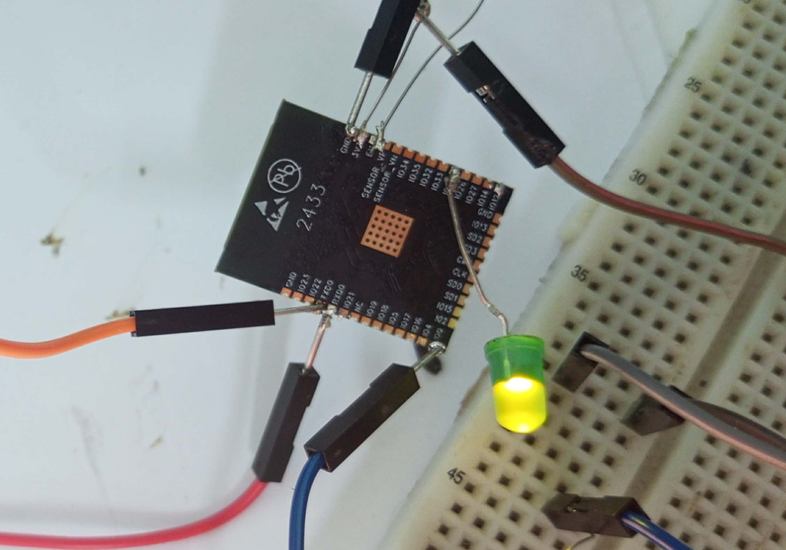
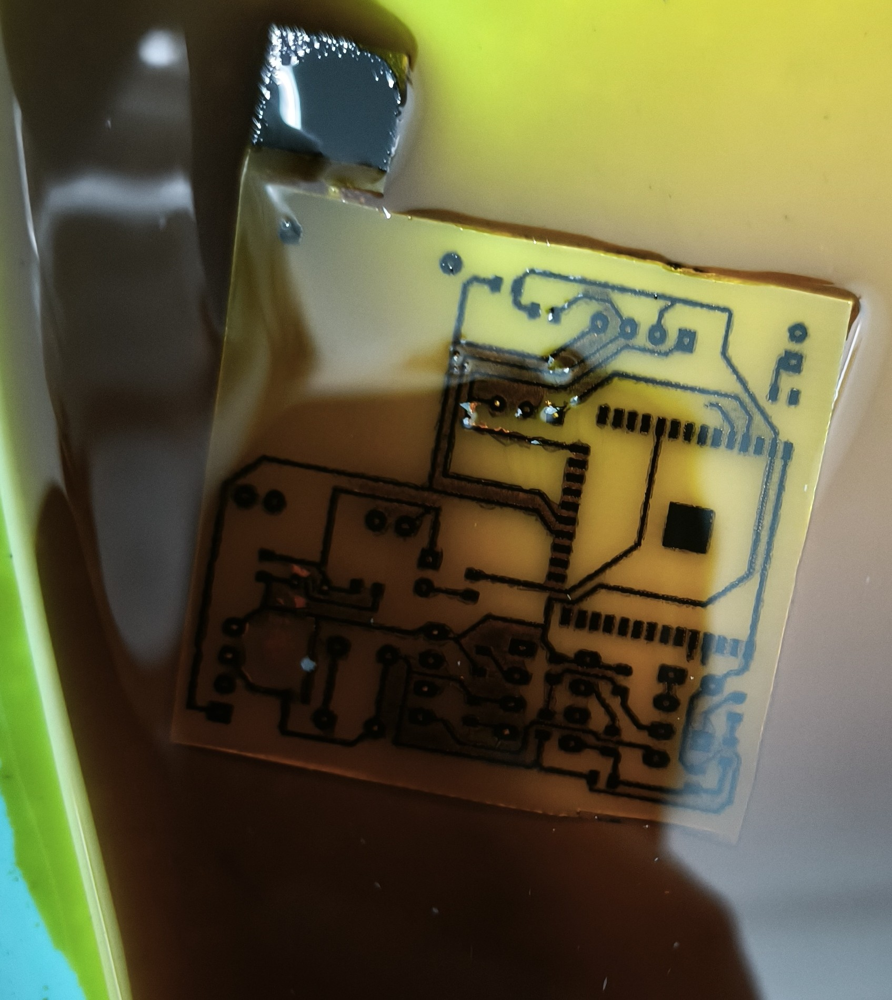
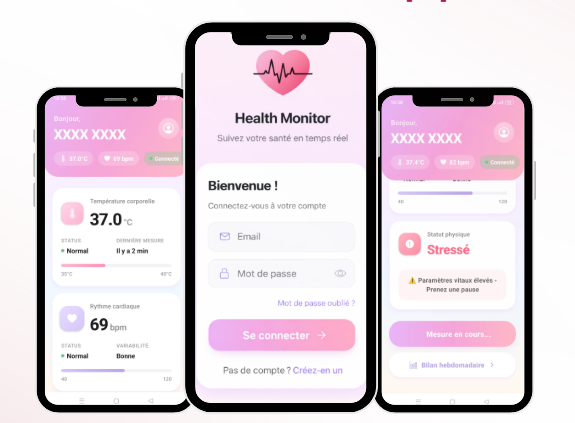
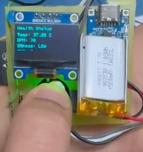

# BioSense – Smart Wearable Health Monitoring System

## Overview

BioSense is a compact wearable PCB-based health monitoring system designed for continuous physiological monitoring and smart health insight generation.

The system monitors three essential physiological parameters:

- Body Temperature
- Heart Rate (BPM)
- Stress Level (GSR-based monitoring)

It combines a custom-designed wearable PCB, embedded firmware using ESP32-WROOM-32, and a mobile application for real-time visualization, weekly trend analysis, and intelligent health alerts.

This project was developed for the IEEE SSCS Tunisia Section Chapter – TSYP 13 Technical Challenge under the challenge:

**“VitalWear – Wearable PCB for Monitoring Vital Signs”**

---

# Features

## Real-Time Monitoring

- Non-contact body temperature measurement
- Beat-to-beat heart rate detection
- Galvanic Skin Response (GSR) stress monitoring
- OLED real-time display for direct feedback

## Smart Alerts

- Fever alert when Temperature > 38°C
- High heart rate alert when BPM > 100
- High stress level detection
- Low battery hardware alert

## Wireless Communication

- BLE communication with mobile application
- Wi-Fi capable ESP32 architecture
- OTA-ready firmware structure

## Power Efficient Design

- Light-sleep and deep-sleep modes
- Rechargeable Li-Po battery
- Low-power wearable architecture

---

# Hardware Components

| Component | Function |
|---|---|
| ESP32-WROOM-32 | Main processing + BLE/Wi-Fi |
| MLX90614 | IR Temperature Sensor |
| SEN-11574 | Heart Rate PPG Sensor |
| LM358 + ICL7660S | GSR Stress Monitoring Circuit |
| OLED SSD1306 | Real-time Display |
| TP4056 | Battery Charging Module |
| MCP1700 | 3.3V LDO Regulator |
| Li-Po Battery | Portable Power Supply |

PCB dimensions:

**45 mm × 50 mm**

---

# System Workflow

```text
Start Measurement
        ↓
Data Acquisition
        ↓
Data Processing
        ↓
Threshold Comparison
        ↓
Alert Activation
        ↓
Display Results
        ↓
Mobile App Analysis
````

Measurement can be triggered by:

* Local PCB push button
* Mobile application via BLE

---

# PCB Design Methodology

## Step 1 — Schematic Capture

The complete circuit was designed using KiCad, integrating:

* ESP32 module
* Temperature sensor
* Heart rate sensor
* Stress monitoring circuit
* OLED display
* Battery charging and regulation
* Alert system

---

## Step 2 — PCB Routing

A compact PCB layout was created for wearable integration with optimized routing for:

* Signal integrity
* Minimal size
* Low power consumption
* Easy assembly

---

## Step 3 — Laser Engraving

The copper board was coated and laser engraved to transfer the PCB layout accurately.

---

## Step 4 — Ferric Chloride Etching

The board was immersed in ferric chloride (FeCl₃) to chemically remove excess copper and reveal the final conductive traces.

---

## Step 5 — Drilling & Soldering

After etching:

* holes were drilled
* components were soldered
* final testing was performed

---

# ESP32 Module – Code Uploading & Testing

This stage shows the ESP32-WROOM-32 module connected on breadboard for firmware uploading, debugging, and validation before final PCB integration.

<p align="center">
  
</p>
Main validation tasks:

* Firmware uploading using ESP32 programmer
* GPIO testing
* Sensor validation
* LED alert verification
* BLE communication testing
* Initial power checks

---

# PCB Fabrication – Ferric Chloride Etching Process

After schematic design and routing, the PCB was physically fabricated using ferric chloride chemical etching.

This process removes unwanted copper and produces the final PCB conductive traces.

<p align="center">
  
</p>
Fabrication workflow:

1. Schematic capture
2. PCB routing
3. Laser engraved coated copper board
4. Ferric chloride etching
5. Cleaning and drilling
6. Component soldering

---

# Mobile Application Interface

The BioSense mobile application provides real-time monitoring and health analysis through a simple and intuitive interface.

Displayed information:

* Body temperature
* Heart rate (BPM)
* Stress level
* Weekly trends
* Historical monitoring
* Smart alerts and recommendations

<p align="center">
  
</p>

Main features:

* BLE synchronization with wearable device
* Real-time physiological dashboard
* Weekly health summary
* Smart alert notifications
* Continuous health tracking

---

# Final Working Prototype

Final assembled wearable prototype integrating sensors, OLED display, battery system, and custom PCB.

<p align="center">
  
</p>

Final capabilities:

* Portable wearable health monitoring
* OLED real-time display
* Independent alert system
* Rechargeable battery operation
* BLE synchronization with mobile application

---

# Signal Processing Pipeline

## Heart Rate Extraction

The system applies:

* Digital low-pass filtering
* Peak detection
* Adaptive thresholding
* Inter-beat interval computation

This ensures stable BPM estimation even with moderate movement.

---

## GSR-Based Stress Estimation

Stress level is estimated using:

```text
Stress Index = VGSR / Vbaseline
```

This allows classification into:

* Low Stress
* Medium Stress
* High Stress

---

## Temperature Smoothing

Temperature readings are stabilized using:

* Moving average filtering
* Outlier suppression

This improves accuracy and reliability.

---

# Simulation & Validation

The system was first validated using:

* Wokwi
* Crocodile Clips

Performance achieved:

## Accuracy

* Temperature measurement: ±0.3°C
* Heart rate detection error: < 5 BPM
* Stress response latency: < 3 seconds

## Functional Validation

Verified successfully:

* Sensor acquisition
* Alert triggering
* BLE communication
* OLED display update
* Push-button wake-up
* Light-sleep management
* Low-battery detection

---

# Technologies Used

## Hardware

* ESP32-WROOM-32
* KiCad
* MLX90614
* SEN-11574
* LM358
* OLED SSD1306
* TP4056
* MCP1700

## Software

* Embedded C / Arduino IDE
* BLE Communication
* Mobile Application Development

## Validation Tools

* Wokwi
* Crocodile Clips

## PCB Manufacturing

* Laser engraving
* Ferric chloride etching
* Manual soldering

---
