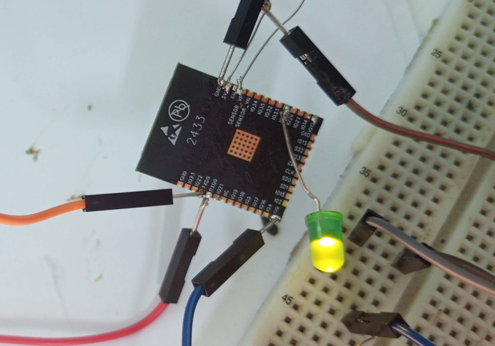
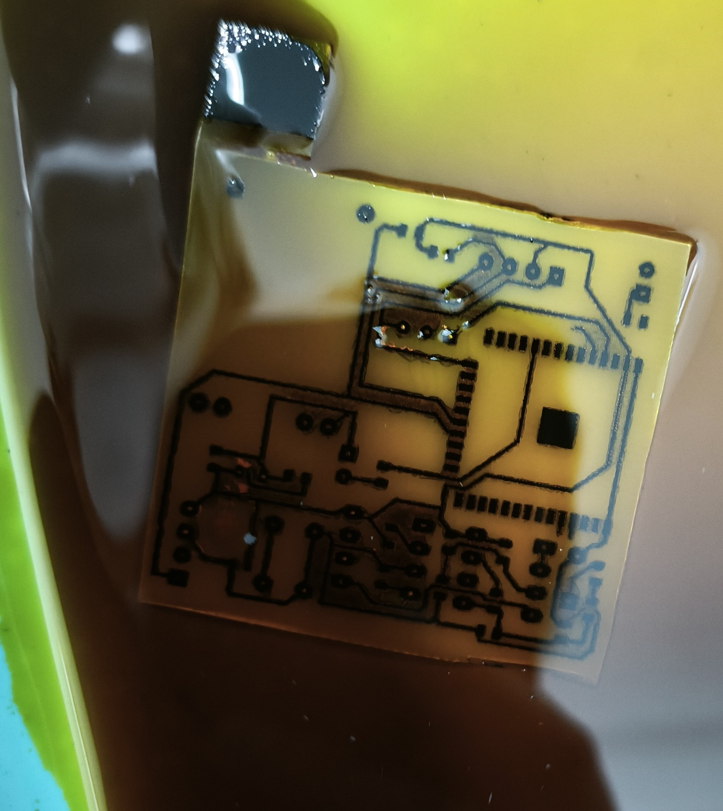
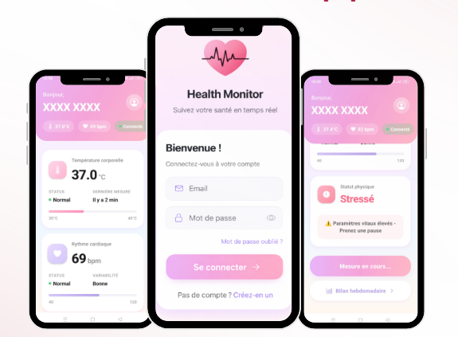
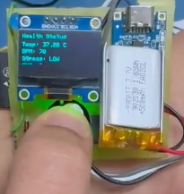
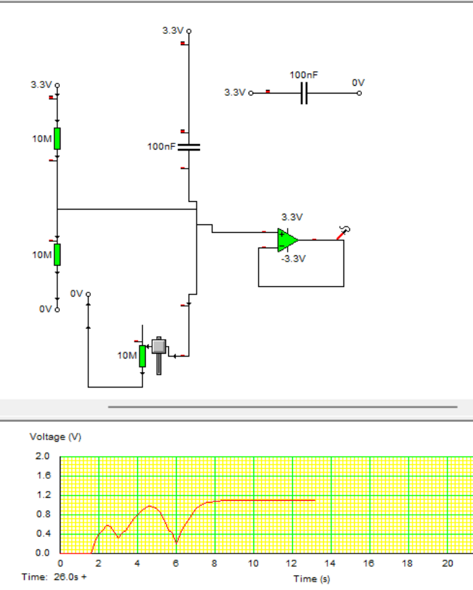
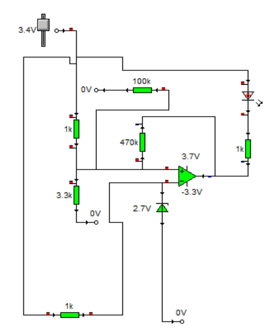

# BioSense – Smart Wearable Health Monitoring System

## Overview

**BioSense** is a compact wearable PCB-based health monitoring system designed for continuous physiological monitoring and smart health insight generation.

The system monitors three essential physiological parameters:

- **Body Temperature**
- **Heart Rate / BPM**
- **Stress Level using GSR-based monitoring**

BioSense combines a custom-designed wearable PCB, embedded firmware based on the **ESP32-WROOM-32**, and a mobile application for real-time visualization, weekly trend analysis, and intelligent health alerts.

This project was developed for the **IEEE SSCS Tunisia Section Chapter – TSYP 13 Technical Challenge** under the challenge:

> **“VitalWear – Wearable PCB for Monitoring Vital Signs”**

The final system is implemented on a compact **45 mm × 50 mm PCB**, making it suitable for wearable integration while maintaining low power consumption, reliable sensor acquisition, and real-time user feedback.

---

# Features

## Real-Time Monitoring

- Non-contact body temperature measurement using the **MLX90614 IR temperature sensor**
- Beat-to-beat heart rate detection using the **SEN-11574 optical PPG sensor**
- Galvanic Skin Response **GSR-based stress monitoring**
- OLED real-time display for direct feedback
- BLE communication with the mobile application

## Smart Alerts

- Fever alert when body temperature is greater than **38°C**
- High heart rate alert when BPM is greater than **100 BPM**
- High stress level detection based on GSR variation
- Low-battery hardware alert using an independent analog indicator circuit

## Wireless Communication

- BLE communication with the mobile application
- Wi-Fi-capable ESP32 architecture
- OTA-ready firmware structure

## Power Efficient Design

- ESP32 light-sleep and deep-sleep modes
- Push-button wake-up mechanism
- Rechargeable Li-Po battery
- TP4056 charging module
- MCP1700 3.3 V low-dropout regulator
- Independent low-battery indicator circuit

---

# Hardware Components

| Component | Function |
|---|---|
| ESP32-WROOM-32 | Main processing unit, BLE/Wi-Fi communication, sensor acquisition, and signal processing |
| MLX90614 | Non-contact infrared body temperature sensor |
| SEN-11574 | Optical PPG heart rate sensor |
| LM358 + ICL7660S | GSR stress monitoring and analog signal conditioning circuit |
| OLED SSD1306 | Real-time display for temperature, BPM, stress level, and system status |
| TP4056 | Li-Po battery charging module |
| MCP1700 | Stable 3.3 V low-dropout voltage regulator |
| Zener 2.7 V + LM358 | Low-battery indicator circuit |
| Li-Po Battery | Portable rechargeable power supply |

PCB dimensions:

**45 mm × 50 mm**

---

# System Workflow

```text
Start Measurement
        ↓
Sensor Data Acquisition
        ↓
Signal Conditioning
        ↓
Digital Processing on ESP32
        ↓
Threshold Comparison
        ↓
Alert Activation
        ↓
OLED Display Update
        ↓
BLE Data Transmission
        ↓
Mobile App Analysis
```

Measurement can be triggered by:

- Local PCB push button
- Mobile application command via BLE

---

# PCB Design Methodology

## Step 1 — Schematic Capture

The complete circuit was designed using **KiCad**, integrating:

- ESP32-WROOM-32 processing and communication unit
- MLX90614 temperature sensor
- SEN-11574 heart rate sensor
- GSR stress monitoring circuit
- OLED SSD1306 display
- Battery charging and regulation system
- Health alert LED
- Low-battery indicator circuit

---

## Step 2 — PCB Routing

A compact PCB layout was created for wearable integration with optimized routing for:

- Signal integrity
- Reduced analog noise
- Minimal size
- Low power consumption
- Easy assembly and testing

---

## Step 3 — Laser Engraving

The copper board was coated and laser engraved to transfer the PCB layout accurately.

---

## Step 4 — Ferric Chloride Etching

The board was immersed in ferric chloride **FeCl₃** to chemically remove excess copper and reveal the final conductive traces.

---

## Step 5 — Drilling & Soldering

After etching:

- Holes were drilled
- Components were soldered
- Continuity checks were performed
- Final testing was completed

---

# ESP32 Module – Code Uploading & Testing

This stage shows the **ESP32-WROOM-32** module connected on a breadboard for firmware uploading, debugging, and validation before final PCB integration.

<p align="center">
  
</p>

Main validation tasks:

- Firmware uploading using an ESP32 programmer
- GPIO testing
- Sensor validation
- LED alert verification
- BLE communication testing
- Initial power checks

The ESP32-WROOM-32 acts as the central processing unit of the system. It collects sensor data, applies filtering and threshold comparison, manages the OLED display, controls alert indicators, and communicates processed data to the mobile application using BLE.

---

# PCB Fabrication – Ferric Chloride Etching Process

After schematic design and routing, the PCB was physically fabricated using ferric chloride chemical etching.

This process removes unwanted copper and produces the final conductive traces of the wearable PCB.

<p align="center">
  
</p>

Fabrication workflow:

1. Schematic capture
2. PCB routing
3. Laser engraving of coated copper board
4. Ferric chloride etching
5. Cleaning and drilling
6. Component soldering
7. Electrical and functional testing

---

# Mobile Application Interface

The BioSense mobile application provides real-time monitoring and health analysis through a simple and intuitive interface.

Displayed information:

- Body temperature
- Heart rate in BPM
- Stress level
- Weekly trends
- Historical monitoring
- Smart alerts and recommendations

<p align="center">
  
</p>

Main features:

- BLE synchronization with the wearable device
- Real-time physiological dashboard
- Weekly health summary
- Stress and heart-rate trend visualization
- Smart alert notifications
- Continuous health tracking

The application transforms raw sensor measurements into user-friendly information, helping the user understand both real-time values and longer-term physiological patterns.

---

# Final Working Prototype

Final assembled wearable prototype integrating sensors, OLED display, battery system, and custom PCB.

<p align="center">
  
</p>

Final capabilities:

- Portable wearable health monitoring
- OLED real-time display
- Independent alert system
- Rechargeable battery operation
- BLE synchronization with mobile application
- Hardware low-battery warning
- Stress monitoring through GSR signal processing

---

# GSR Stress Monitoring Indicator

## Purpose

The **GSR indicator** is used to estimate the user’s stress level by measuring changes in skin electrical conductance.

GSR stands for **Galvanic Skin Response**. It is based on the relationship between emotional stress and electrodermal activity. When a person experiences stress, concentration, fear, or emotional pressure, the sympathetic nervous system becomes more active. This activates sweat glands, especially eccrine sweat glands, which changes the electrical properties of the skin.

As stress increases:

- Sweat gland activity increases
- Skin resistance decreases
- Skin conductance increases
- The GSR circuit output voltage changes
- The ESP32 interprets this variation as a stress-level change

This makes GSR useful for detecting stress during daily activities, study sessions, emotional pressure, or physical effort.

---

## GSR Circuit Architecture

The GSR monitoring block is built using:

- Two skin-contact electrodes
- LM358 dual operational amplifier
- ICL7660S voltage converter / charge pump
- Analog filtering and conditioning components
- ESP32 ADC input

The two electrodes are placed on the skin and form a variable-resistance path. This resistance depends on the user’s skin conductance. When the user is relaxed, the resistance is usually higher. When stress increases, perspiration increases and the resistance becomes lower.

The **LM358** is used as the analog conditioning stage. Its role is to amplify and adapt the small GSR signal so that it can be read correctly by the ESP32 ADC.

The **ICL7660S** generates a negative voltage rail from the available supply. This helps the LM358 operate with better signal swing near ground, improving the resolution and sensitivity of the GSR measurement.

---

## GSR Operating Principle

```text
Skin Electrodes
        ↓
Variable Skin Resistance
        ↓
LM358 Analog Conditioning
        ↓
Conditioned GSR Voltage
        ↓
ESP32 ADC Sampling
        ↓
Digital Filtering
        ↓
Baseline Normalization
        ↓
Stress Index Calculation
        ↓
Stress Classification
```

The ESP32 continuously samples the conditioned analog voltage from the GSR circuit. Since GSR values differ from one person to another, the system uses a baseline-based approach instead of relying only on a fixed threshold.

The stress index is calculated using:

```text
Stress Index = VGSR / Vbaseline
```

Where:

- **VGSR** is the current measured GSR voltage.
- **Vbaseline** is the reference value measured during a normal or relaxed state.

This allows the system to detect stress relative to the user’s own normal condition.

---

## Stress Classification

The GSR signal is classified into three main levels:

| Stress Level | Description |
|---|---|
| Low Stress | GSR value remains close to the baseline |
| Medium Stress | Moderate variation compared to the baseline |
| High Stress | Significant increase in GSR response compared to the baseline |

A high stress alert is triggered when the stress index remains above the defined threshold for a certain duration. This helps reduce false alerts caused by short movement artifacts, temporary electrode contact issues, or sudden noise spikes.

---

## Role of the GSR Indicator in BioSense

The GSR indicator:

- Provides continuous stress-level estimation
- Detects physiological changes linked to emotional or physical stress
- Enables real-time stress alerts
- Sends stress information to the mobile app through BLE
- Supports weekly stress trend analysis
- Helps users identify repeated stress peaks during the day

---

# Battery Indicator and Power Management

## Purpose

The battery indicator is responsible for warning the user when the Li-Po battery voltage becomes too low.

This is important because BioSense is a wearable health-monitoring device. The system must avoid unexpected shutdowns during measurement, especially when monitoring heart rate, temperature, and stress level.

Unlike a software-only battery monitor, BioSense uses a **hardware low-battery indicator**. This means the circuit can still detect a low-battery condition even when the ESP32 is in light-sleep or deep-sleep mode.

---

## Power Management Architecture

The power system includes:

- **3.7 V Li-Po battery**
- **TP4056 charging module**
- **MCP1700 3.3 V LDO regulator**
- **Low-battery indicator using LM358 and 2.7 V Zener diode**

The **TP4056** charges the Li-Po battery using a constant-current / constant-voltage charging method. It also provides charging status feedback.

The **MCP1700** generates a clean and stable **3.3 V rail** for the ESP32 and sensors. It is suitable for wearable applications because it has low dropout voltage and very low quiescent current.

---

## Low-Battery Indicator Circuit

The low-battery indicator circuit is based on:

- 2.7 V Zener diode
- LM358 operational amplifier
- Voltage divider
- Red LED indicator
- Current-limiting resistor

The Zener diode generates a stable reference voltage. The battery voltage is scaled using a voltage divider, then compared with the Zener reference using the LM358.

When the battery voltage drops below the selected threshold, the LM358 output activates the red LED.

---

## Battery Alert Condition

```text
Vbatt < 3.4 V  →  Red LED ON
```

This means that when the battery voltage becomes lower than approximately **3.4 V**, the red LED turns on to warn the user that the device should be recharged.

When the battery voltage is still acceptable:

```text
Vbatt ≥ 3.4 V  →  Red LED OFF
```

---

## Battery Indicator Operating Principle

```text
Battery Voltage
        ↓
Voltage Divider
        ↓
Comparison with 2.7 V Zener Reference
        ↓
LM358 Output Decision
        ↓
Red LED ON / OFF
```

The circuit works independently from the ESP32. This improves system reliability because the user can still receive a low-battery warning even when the microcontroller is sleeping to save energy.

---

## Advantages of the Hardware Battery Indicator

The hardware low-battery indicator provides several advantages:

- Works independently from firmware
- Can operate while the ESP32 is in sleep mode
- Provides immediate visual feedback
- Reduces the need for continuous ADC battery measurement
- Helps prevent unexpected shutdown
- Improves safety and usability for wearable operation

---

## Role of the Battery Indicator in BioSense

The battery indicator:

- Continuously monitors battery voltage
- Detects when the battery reaches a low-charge state
- Activates a red LED when recharging is needed
- Supports safe and reliable wearable operation
- Helps manage device autonomy
- Protects measurements from interruption due to low battery

---

# Signal Processing Pipeline

## Heart Rate Extraction

The heart rate signal is obtained from the SEN-11574 optical PPG sensor.

The system applies:

- Digital low-pass filtering
- Peak detection
- Adaptive thresholding
- Inter-beat interval computation

The BPM value is calculated from the time interval between detected peaks. This provides stable heart-rate estimation even with moderate hand movement.

---

## GSR-Based Stress Estimation

Stress level is estimated using:

```text
Stress Index = VGSR / Vbaseline
```

The GSR processing includes:

- Analog conditioning using LM358
- ADC sampling by the ESP32
- Digital smoothing
- Baseline normalization
- Threshold comparison
- Stress-level classification

This allows classification into:

- Low Stress
- Medium Stress
- High Stress

---

## Temperature Smoothing

Temperature readings are stabilized using:

- Moving average filtering
- Outlier suppression

This improves accuracy and reliability by reducing fluctuations caused by small distance or orientation changes between the MLX90614 sensor and the skin.

---

# Prototype Validation & Testing

The BioSense system was not only validated through simulation, but also implemented as a real working prototype and tested physically after PCB fabrication and assembly.

Validation was performed in two stages:

- Software and circuit validation using **Wokwi** and **Crocodile Clips**
- Real prototype testing using the assembled PCB, sensors, OLED display, battery system, and mobile application

---

## Simulation Screenshots

Before testing the physical prototype, the main analog circuits were validated using **Crocodile Clips** simulation. These simulations helped verify the behavior of the GSR stress-monitoring circuit and the low-battery LED indicator before final PCB testing.

### GSR Circuit Simulation

The GSR circuit was simulated to observe how the output voltage changes when the equivalent skin resistance varies. This validates the ability of the circuit to detect changes in skin conductance related to stress level.

<p align="center">
  
</p>

The simulation confirms that the GSR analog front-end can generate a measurable voltage variation when the equivalent skin resistance changes. This output is later read by the ESP32 ADC and processed to estimate the stress index.

### Low-Battery Indicator Simulation

The low-battery indicator circuit was also simulated to verify that the red LED turns on when the battery voltage drops below the defined threshold.

<p align="center">
  
</p>

The simulation validates the behavior of the hardware battery indicator based on the **LM358 comparator** and **2.7 V Zener reference**. When the battery voltage becomes lower than approximately **3.4 V**, the comparator output activates the red LED to warn the user that the device needs charging.

---

## Prototype Testing

After soldering the components and completing the PCB, the prototype was powered using the rechargeable Li-Po battery and tested in real conditions.

The following parts were verified on the physical prototype:

- ESP32 firmware uploading and execution
- GPIO operation
- OLED display update
- MLX90614 temperature measurement
- SEN-11574 heart rate signal acquisition
- GSR stress signal response
- Health alert LED activation
- Low-battery indicator behavior
- BLE communication with the mobile application
- Push-button wake-up and measurement triggering

---

## Functional Validation

The prototype successfully demonstrated the complete measurement workflow:

```text
User starts measurement
        ↓
ESP32 wakes up
        ↓
Sensors acquire physiological data
        ↓
Signals are processed
        ↓
Values are displayed on OLED
        ↓
Alerts are checked
        ↓
Data is sent to the mobile app through BLE
```

The device was tested in different usage situations, including resting state, normal use, and stress-inducing conditions. During these tests, the system showed visible changes in heart rate and GSR response, confirming that the prototype reacts to physiological variations.

---

## Test Results

| Test | Result |
|---|---|
| Temperature measurement | Successfully displayed stable temperature values |
| Heart rate measurement | BPM values detected and shown on OLED/mobile app |
| GSR stress monitoring | Stress response changed according to skin conductance variation |
| OLED display | Successfully displayed real-time values |
| Health alert LED | Activated when thresholds were exceeded |
| BLE communication | Data successfully transmitted to the mobile app |
| Push button | Successfully triggered local measurement |
| Battery system | Prototype operated using rechargeable Li-Po battery |
| Low-battery indicator | Hardware indicator circuit validated |

---

## Validation Summary

The real prototype confirmed that the BioSense wearable system is functional and capable of measuring the required physiological parameters. The tests showed that the device can acquire sensor data, process it using the ESP32, display results locally, send values to the mobile app, and activate alerts when abnormal conditions are detected.

This physical validation proves that BioSense is more than a simulation: it is a working wearable health-monitoring prototype.

---

# Energy Budget

Energy analysis was performed using a **3.7 V / 500 mAh Li-Po battery**.

In active measurement mode, the total current consumption is approximately **110 mA**, including the ESP32, BLE communication, OLED display, sensors, GSR circuit, and auxiliary logic.

| Subsystem | Typical Current |
|---|---|
| ESP32-WROOM-32 | ~50 mA |
| MLX90614 | ~1.4 mA |
| SEN-11574 Pulse Sensor | ~4 mA |
| GSR LM358 Stage | ~1 mA |
| OLED SSD1306 | ~15 mA |
| Miscellaneous logic / LED / regulator losses | ~2 mA |
| Total active measurement mode | ~110 mA |

Estimated autonomy:

| Usage Scenario | Estimated Autonomy |
|---|---|
| Light usage | ~19 days |
| Typical usage | ~9–10 days |
| Intensive usage | ~4 days |
| Continuous operation | ~4–5 hours |

Possible power optimizations:

- Reduce sampling frequency in idle mode
- Turn off the OLED between measurements
- Use ESP32 deep-sleep mode with interrupt wake-up
- Optimize firmware computation time
- Reduce BLE advertising and notification frequency

---

# Technologies Used

## Hardware

- ESP32-WROOM-32
- KiCad
- MLX90614
- SEN-11574
- LM358
- ICL7660S
- OLED SSD1306
- TP4056
- MCP1700
- 3.7 V Li-Po battery

## Software

- Embedded C / Arduino IDE
- BLE communication
- Mobile application development
- Digital signal processing

## Validation Tools

- Wokwi
- Crocodile Clips

## PCB Manufacturing

- Laser engraving
- Ferric chloride etching
- Manual drilling
- Manual soldering

---

# Conclusion

BioSense successfully integrates three physiological measurements into a compact wearable PCB platform:

- Body temperature
- Heart rate
- Stress level using GSR

The system combines sensor acquisition, analog signal conditioning, ESP32-based processing, OLED visualization, BLE communication, mobile app monitoring, and battery-aware operation.

The enhanced GSR indicator allows stress estimation through skin conductance variation, while the independent battery indicator improves system reliability by warning the user when the Li-Po battery voltage becomes too low.

BioSense demonstrates a practical, low-power, and compact wearable health-monitoring solution suitable for real-time monitoring and smart health insight generation.
````
